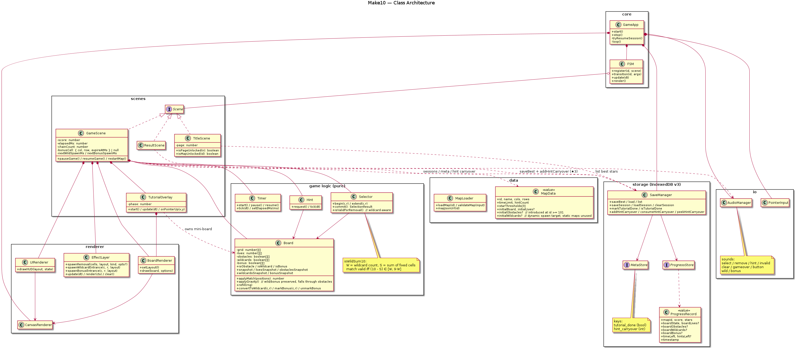
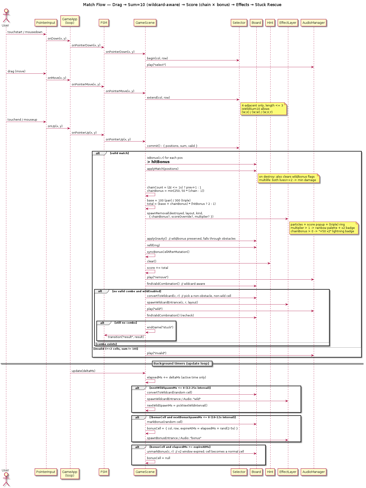
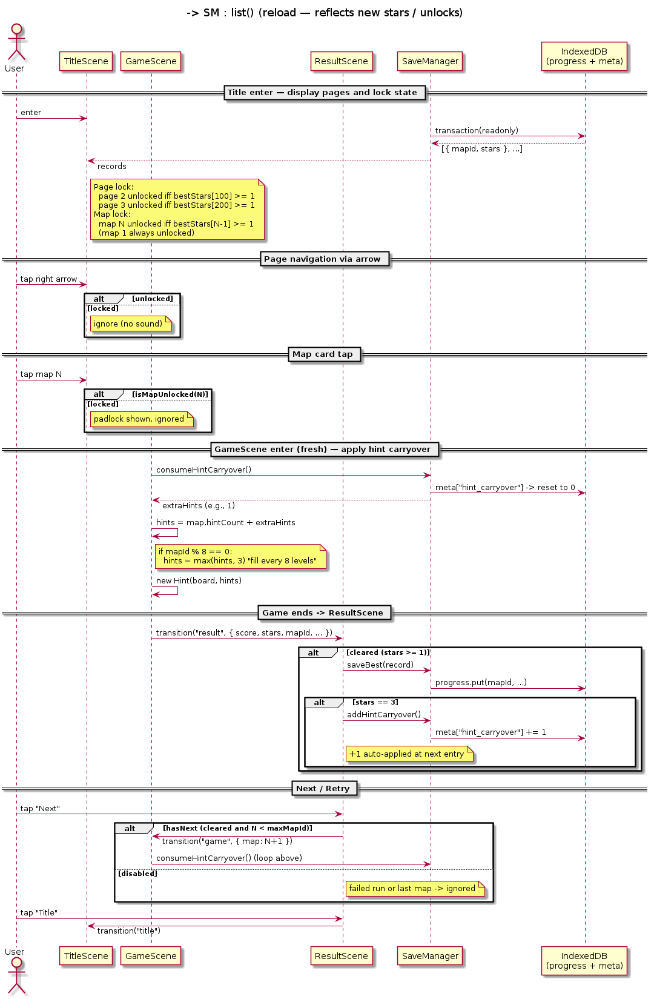
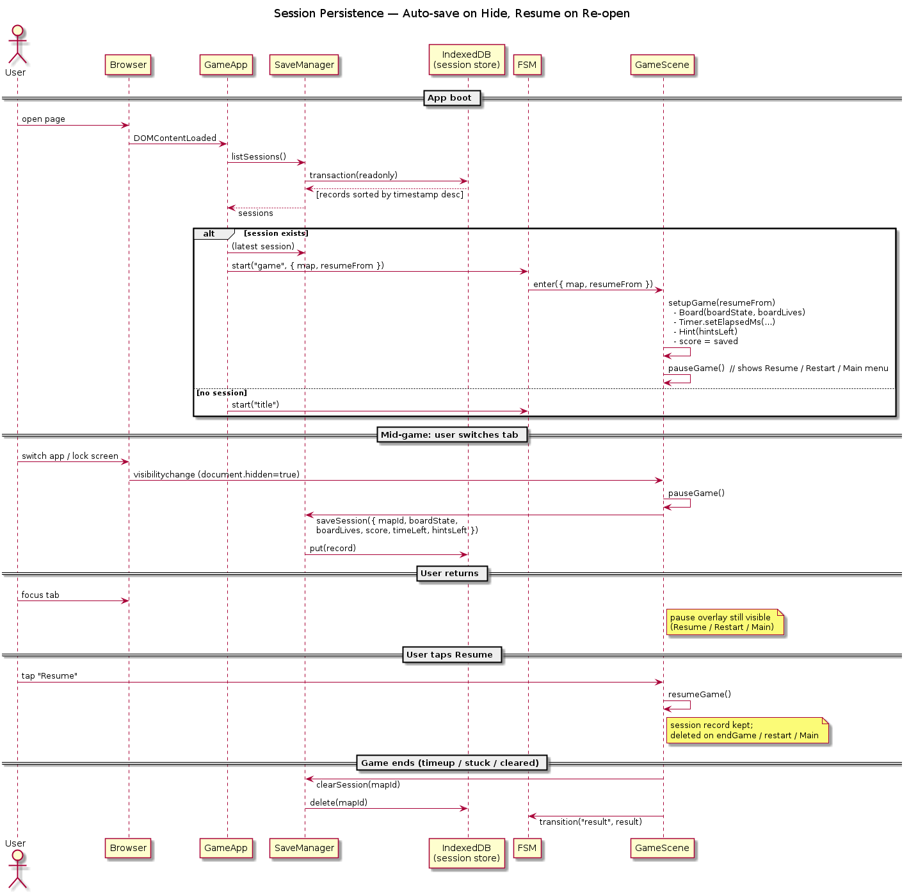
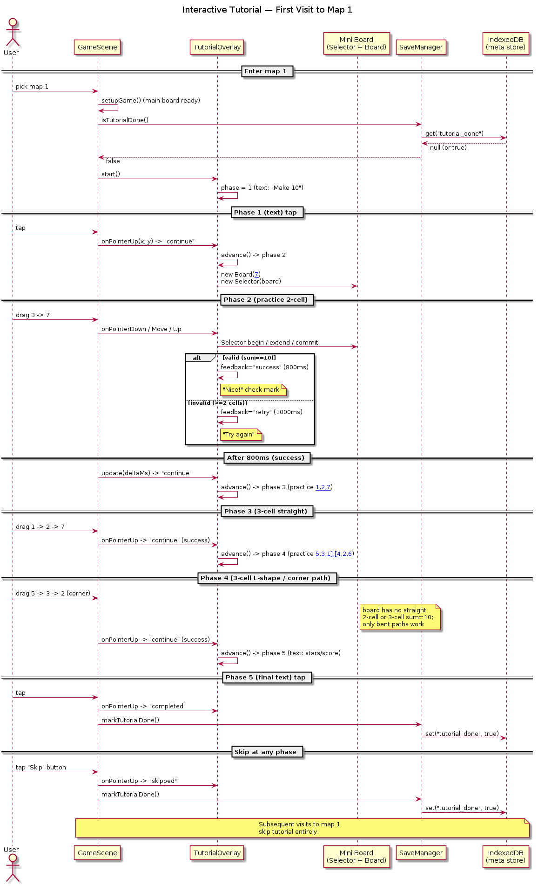

# Make10

합이 10이 되는 이웃 셀을 드래그로 골라 제거하는 숫자 퍼즐 웹앱.

## 게임 방법

- 격자의 셀을 **상하좌우**로 드래그해 **2개 또는 3개**를 선택합니다 (대각선 불가).
- 3셀 선택은 직선뿐 아니라 **ㄱ자/L자 등 꺾인 경로**도 가능합니다.
- 선택한 셀의 **합이 정확히 10**이면 제거됩니다 (만능 블럭은 어떤 숫자에도 부족분을 채워 줌 — 아래 참고).
- 제거 후 **중력**이 작동해 위에 있던 블럭이 빈 칸을 채우며 낙하 → 상단에는 **새 블럭이 생성**되어 보드가 항상 가득 찬 상태를 유지합니다 (Bejeweled 스타일).
- 상단의 **무지개 띠**가 남은 시간을 표시합니다 (오른쪽부터 줄어듦).
- 종료 조건
  - **⏱ 시간 초과**: 타이머가 0에 도달 (주 종료 경로)
  - **🏁 진행 불가**: 만능 블럭 자동 회복으로도 매치 경로가 없을 때 (극히 드뭄 — 아래 참고)
- **⏸ 일시정지** (좌측 상단 버튼): 누르면 타이머와 힌트가 멈추고 메뉴 오버레이가 뜹니다. 오버레이 버튼: **▶ 재개 / 🔁 다시하기 / 🏠 메인**.
- 우측 상단의 **💡 힌트** 버튼으로 유효 조합을 3초간 표시 (맵별 횟수 제한 — 아래 보충 규칙 참고).

### 점수 & 별점

- **2셀 매치 +100**, **3셀 매치 +300**.
- **연쇄(chain) 보너스**: 직전 매치로부터 **1초 이내**에 다음 매치를 성공하면 누적 보너스 적용.
  - 2연쇄 +50 / 3연쇄 +100 / 4연쇄 +150 / 5연쇄 +200 / **6연쇄 이상 +250 (cap)**.
  - 보너스는 베이스 점수 + 연쇄 보너스 + (보너스 블럭 적중 시 ×2) 순으로 합산.
- **별 3개 단계**: 맵 시작 시 ★/★★/★★★ 목표 점수를 안내. 종료 시 최종 점수로 별 개수 결정.
  - ★ 이상이면 성공으로 기록되며 타이틀 화면에 별이 표시됩니다.
  - **★★★ 클리어 시 다음 판 힌트 +1 (영속 carryover)**.

### 매치 이펙트

매치 시 셀 제거에 시각 피드백:
- 베이스: 방사형 파티클(중력+마찰) + `+100`/`+300` 점수 팝업.
- 3셀: 파티클 더 많고 골드 팔레트 + 외곽/내부 2겹 확장 링.
- 연쇄: 베이스 위에 `⚡ +50 x2` 형태의 하늘색 배지 추가.
- 보너스 적중(×2): 무지개 팔레트 파티클 + `× 2` 핑크 배지 + 핑크 링.

## 1판 인터랙티브 튜토리얼

첫 방문 시 1판에 들어가면 5단계 튜토리얼이 노출됩니다 (한 번 끝낸 뒤로는 재노출 없음, IndexedDB에 영속 저장).

1. 🎯 목표 안내 (텍스트)
2. ✏️ 2셀 실습 — `[3, 7]` 미니 보드에서 직접 드래그
3. ✨ 3셀 직선 실습 — `[1, 2, 7]`
4. ↳ 3셀 ㄱ자 실습 — `[[5, 3, 1], [4, 2, 6]]` (꺾인 경로만 정답)
5. ⭐ 점수와 별 안내 (텍스트)

우상단 **건너뛰기** 버튼은 어느 단계에서든 즉시 종료(완료 처리).

## 레벨 진행 시스템 (1 ~ 300)

- **순차 잠금**: 1번 맵은 항상 열려 있고, 그 외 맵 N은 직전 맵 N-1을 ★ 1개 이상으로 클리어해야 진입 가능.
- **페이지 네비게이션**: 타이틀에서 **1-100 / 101-200 / 201-300** 100단위 페이지로 표시. 좌/우 화살표로 이동.
  - **페이지 2(101-200) 잠금 해제** = 100번 맵 ★≥1.
  - **페이지 3(201-300) 잠금 해제** = 200번 맵 ★≥1.
- 잠긴 카드는 회색 + 🔒 자물쇠. 탭해도 진입 불가.
- ResultScene의 "➡️ 다음" 버튼도 같은 정책 — 실패한 판에서는 비활성.

## 멀티라이프 블럭 (id ≥ 10)

10판부터 일부 셀에 **lives 2~5**의 멀티라이프 블럭이 등장합니다. 매치 한 번에 사라지지 않고 lives가 깎이며, 0이 되어야 제거됩니다.

- **최대 lives** = `min(5, 1 + floor(id/10))` → 10s=2, 20s=3, 30s=4, 40s=5+.
- **출현 비율** ≤ 15% (난이도에 따라 5%→15%로 증가).
- **데미지 규칙**:
  - 2셀 매치, 양쪽 모두 lives ≥ 2 → `min(A.lives, B.lives)` 만큼 양쪽 차감 (작은 쪽 즉시 제거).
  - 그 외(2셀 한쪽만 멀티 / 3셀 매치) → 매치된 셀당 1 데미지, 0이면 제거.
- **시각화**: 적록 색맹을 고려해 **파랑 단색조 명도 그라데이션** + 좌상단 `xN` 텍스트 배지.
  - lives 1=흰, 2=연하늘, 3=하늘, 4=중파랑, 5=네이비.

## 장애물 블럭 (id ≥ 101)

파괴 불가의 고정 장애물(🪨)이 보드에 배치됩니다.

- **출현 구간**: id 101–199 ≤ 2%, id 200–300 ≤ 5%.
- **중력**: 장애물은 제자리 고정. **위쪽 블럭은 장애물을 통과**해 아래쪽 빈 칸에 쌓임.
- **선택 불가**: grid=0 / lives=0 으로 처리되어 드래그 대상에서 제외.
- 시각화: 어두운 회갈색 배경 + 🪨 이모지.

## 만능(?) 블럭

어떤 숫자와도 합 10 매치를 만드는 와일드카드. 보라→핑크 그라데이션 + 흰 `?` 글리프.

- **매칭 규칙** — 선택 내 만능 개수 W, 고정 셀 합 S 라 할 때
  - `(10 - S) ∈ [W, 9·W]` 면 매치 성립.
  - 결과: (?, X) 어떤 숫자든 매치 / (?, ?) 매치 / (?, X, Y)는 X+Y ∈ [1, 9].
- **자동 스폰**:
  - **랜덤 인터벌** — 12–25초 사이 랜덤하게 1개 자동 등장 (최대 3개 동시 존재).
  - **stuck 회복** — 매치 후 유효 조합이 모두 사라지면 즉시 임의 셀을 만능으로 변환해 게임 흐름 유지. 그래도 매치 경로가 없는 극단 상황만 "🏁 진행 불가" 종료.
- 매치되면 일반 블럭처럼 사라지고 점수 합산.
- 등장 시 14입자 수렴 + 보라 확장 링 + `?` 라벨 이펙트 + 전용 사운드.

## 보너스(×2) 블럭

매치 파괴 시 **그 매치 점수에 ×2 배수**를 주는 시간 제한 이벤트.

- **출현 빈도**: 매판 **10–12초 사이 랜덤 인터벌**로 1개 등장 (한 번에 1개만 활성).
- **윈도우**: 등장 후 **2–5초 안에 매치**해야 ×2 적용. 시간 초과 시 자동 해제(보드의 일반 셀로 복귀).
- **점수**: `(베이스 + 연쇄 보너스) × 2`. 예) 3연쇄 3셀 + 보너스 적중 = `(300 + 100) × 2 = 800`.
- **시각화**: 셀 배경이 **HSL 회전 무지개 그라데이션**(매 프레임 갱신) + 흰 외곽선 + 좌상단 `×2` 배지.
  - 등장 시 18입자 무지개 수렴 + 핑크/노랑 2겹 링 + 전용 사운드.

## 힌트 보충 규칙

- 맵별 **기본 hintCount**는 JSON에서 정의 (튜토리얼 3 / 초중급 2 / 상급 1 / 그랜드마스터 등 0).
- **레벨이 8의 배수(8, 16, 24, ..., 296)** 에 진입하면 힌트가 3 미만이어도 **3개로 채움** (`max(현재, 3)`).
- **★3 클리어** 시 다음 판 진입에 **+1** (영속 carryover, IndexedDB meta에 누적).
- 세션 복원(이어하기) 경로는 저장된 잔량 그대로 — 중복 보충 방지.

## 자동 저장 & 이어하기

게임 진행 중 다른 탭/앱으로 이동하거나 화면이 잠기면 **자동으로 일시정지 + 세션 저장**됩니다. 다시 돌아오거나 브라우저를 재실행하면 곧장 일시정지 메뉴(이어하기/다시하기/메인)가 뜹니다.

- 저장 항목: 보드 face value + lives + obstacles + wildcards + bonus 플래그, 점수, 남은 시간, 남은 힌트, 타임스탬프.
- 게임 종료/메인메뉴 진입/다시하기 시 세션 자동 삭제.

## 지원 환경

| 환경 | 비고 |
|------|------|
| PC 브라우저 | 마우스 드래그 |
| 모바일 터치 | 한 손가락 드래그 |
| Galaxy Fold 7 접힘(~376px) · 펼침(~768px) | 레이아웃 비율 자동 조정 |
| HiDPI (Retina 등) | `devicePixelRatio` 자동 스케일 |

## 저장소 (IndexedDB)

DB명 `make10db`, 버전 3. 세 object store 로 구성됩니다.

| 스토어 | 키 | 내용 |
|--------|-----|------|
| `progress` | `mapId` | 맵별 최고 점수/별점 (saveBest로 더 높을 때만 갱신) |
| `session` | `mapId` | 진행 중 게임 상태 (자동 저장/복원, 종료 시 삭제) |
| `meta` | `key` | 키-값 영속 플래그 (`tutorial_done`, `hint_carryover`) |

DB 미지원/오류 환경에서는 조용히 폴백하며 게임은 정상 진행됩니다.

## 실행

정적 서버에서 그대로 열립니다 (외부 런타임 라이브러리 없음).

```bash
./build.sh            # release/ 폴더 생성
python -m http.server 8001 -d release
```

브라우저에서 [http://localhost:8001](http://localhost:8001) 열기.

개발 중에는 루트에서 곧장 서빙해도 됩니다 (`dist/dist.js` 경로).

```bash
npm install           # devDependencies 설치 (최초 1회)
npx esbuild src/main.ts --bundle --outfile=dist/dist.js --target=es2020 --format=iife
python -m http.server 8001
```

## 빌드

| 스크립트 | 플랫폼 |
|----------|--------|
| `build.sh` | Linux / macOS |
| `build.bat` | Windows |

둘 다 `release/` 폴더를 재생성합니다.
결과물: `release/{index.html, dist.js, data/map001.json ... map300.json}`.

## 테스트

```bash
npx ts-node tests/runner.ts
```

직접 구현한 경량 러너로 370+건의 단위/통합 테스트를 실행합니다 (외부 프레임워크 없음).

## 맵 생성

```bash
npx ts-node tools/gen-maps.ts 1 300   # map001 ~ map300 재생성
```

맵은 결정적(`mulberry32` 시드 고정)이며, 1~9 사이 숫자를 랜덤 배치합니다. 초기 보드에 유효 조합이 최소 1개 이상 존재할 때까지 재시도합니다.

| id 구간 | 추가 메커닉 |
|---------|-------------|
| 1–9 | 기본 블럭만 |
| 10–100 | + 멀티라이프(≤15%) |
| 101–199 | + 장애물(≤2%) |
| 200–300 | + 장애물(≤5%) |

## 리소스

- 이모지: 시스템 이모지 폰트 (Apple Color Emoji / Segoe UI Emoji 등). 외부 자산 없음.
- 오디오: Web Audio API `OscillatorNode` 합성. 효과음 파일 없음. 사운드 종류: select / remove / hint / invalid / clear / gameover / button / **wild** / **bonus**.

## Architecture

PlantUML 소스는 [`docs/uml/`](./docs/uml/) 에 있고, 아래 PNG는 `plantuml -tpng docs/uml/*.puml` 로 재생성합니다. 다이어그램 본문 라벨/노트는 모두 **영어**, 캡션은 한국어로 유지합니다.

### Class diagram

전체 모듈/클래스 관계 — `core` → `scenes` → `game logic` / `renderer` / `storage` 의존 흐름. Board 의 obstacle/wildcard/bonus 플래그, EffectLayer, hint carryover 메타까지 포함.



### Sequence: match flow

드래그 → wildcard-aware 합10 판정 → 연쇄 보너스 + ×2 배수 → `applyMatch` (멀티라이프 데미지 분기) → 중력(장애물 통과) → 리필 → stuck 회복(만능 자동 스폰) → 백그라운드 만능/보너스 자동 스폰 타이머.



### Sequence: level progression

타이틀 페이지 잠금(1-100/101-200/201-300) + 맵 순차 잠금 + ★3 클리어로 누적되는 hint carryover 가 다음 진입 시 소비되는 흐름.



### Sequence: session persistence

탭 전환 시 `visibilitychange` → 세션 자동 저장. 부팅 시 최신 세션 발견하면 곧장 일시정지된 GameScene 으로 진입.



### Sequence: tutorial flow

1판 첫 진입 시 5단계 튜토리얼(텍스트 → 2셀 실습 → 3셀 직선 → 3셀 ㄱ자 → 텍스트). 종료/스킵 시 `meta` 스토어에 영속 마킹 → 재진입 시 미노출.



## 디렉토리

```
make10/
├── index.html             # 진입점
├── src/                   # TypeScript 원본
│   ├── core/              # GameApp, FSM
│   ├── scenes/            # Title / Game / Result + TutorialOverlay
│   ├── game/              # Board, Selector, Timer, Hint, Scoring (순수 로직)
│   ├── renderer/          # CanvasRenderer, BoardRenderer, UIRenderer, EffectLayer
│   ├── input/             # PointerInput
│   ├── audio/             # AudioManager
│   ├── data/              # MapLoader
│   └── storage/           # SaveManager (IndexedDB: progress / session / meta)
├── data/                  # map001 ~ map300.json
├── docs/uml/              # PlantUML 소스 + 생성된 PNG
├── tests/                 # 단위 + 통합 테스트
├── tools/                 # gen-maps.ts 등 개발 스크립트
├── build.sh / build.bat   # 릴리스 빌드
└── release/               # 배포 산출물 (빌드 결과)
```

## 라이선스

MIT. 자세한 내용은 [LICENSE](./LICENSE) 참조.
